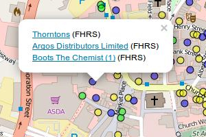
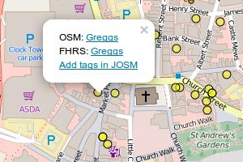

# python-fhrs-osm
Python tools for downloading and comparing Food Hygeine Rating Scheme (FHRS) and OpenStreetMap (OSM) data and finding possible matches between it, together with Leaflet slippy maps for visualising the data. OSM ways are simplified to a single point at the center of the way.

## Features
* Download specific OpenStreetMap and FHRS data using a modified version of overpy and the FHRS API and parse it into a PostgreSQL/PostGIS database
* Use database views to compare OpenStreetMap and FHRS data and find anomalies
* Use a database view to find possible matches between OSM nodes/ways and FHRS establishments, based on proximity and similarity of names
* Export GeoJSON files to use in Leaflet slippy maps, allowing users to visualise OSM/FHRS data as well as to review possible matches between FHRS and OSM data and import useful tags into JOSM

## Requirements
* Tested using Python 2.7 on Ubuntu and Mac OS X
* Uses the following Python modules:
    * Modified version of overpy allowing way centroids to be parsed (module included as overpy_mod). Hopefully this functionality will be included in later versions of overpy as I have made my modifications available through pull requests
    * psycopg2 (can be installed with pip)

## Installation
* Install psycopg2 module (run `pip install psycopg2`)
* Create PostgreSQL database (run `createdb fhrs`)
* Enable PostGIS extension using SQL command `CREATE EXTENSION postgis;`
* Enable fuzzy string matching using SQL command `CREATE EXTENSION fuzzystrmatch;`

## Usage
1. Run `python get_data.py` to download OpenStreetMap and FHRS data to the PostgreSQL database.
    * By default, data for the Rugby area is downloaded, but this can be altered by passing arguments to the relevant functions in `get_data.py`. FHRS data is always downloaded one authority at a time
    * The OSM tag/value pairs to query can also be easily modified
    * Please see the docstrings in `fhrs_osm/__init__.py` for details
* Run `python overview_geojson.py > overview.json` and open `overview.html` in a browser to see an overview map (see below)
* Run `python suggest_matches_geojson.py > suggest_matches.json` and open `suggest_matches.html` in a browser to see a map of suggested matches between OSM and FHRS data (see below)

## Overview map

Multiple establishments in the same location are aggregated because the FHRS position data is reverse geocoded from postcodes
* Locations with at least one OSM entity with an `fhrs:id` value not present in the FHRS data table are **red** e.g. establishments that have closed and are no longer present in the FHRS database
* Locations with at least one OSM entity with no `fhrs:id` tag are **yellow**
* Locations containing at least one establishment from the FHRS database with no matching OSM entity (matched using `fhrs:id` tag) are **blue**
* Locations containing only OSM entities with a valid `fhrs:id` value are **green**

Clicking on a point shows a popup with the name of any OSM entities or FHRS establishments, which link to the FHRS web page for that establishment

## Suggested matches map

By default, this map shows OSM entities with possible matches in the FHRS database, based on the following criteria:
* < 250m distance
* Either FHRS name contains OSM name within it or names are closely matched using Levenshtein distance algorithm

Clicking on a point shows links to the OSM node/way web page and the FHRS establishment web page, as well as allowing the user to copy relevant tag/value pairs into JOSM

## Copyright

Copyright &copy; gregrs-uk 2016, published under the GNU GPL v3.0

Modified version of [overpy](http://github.com/DinoTools/python-overpy) contained in `overpy_mod` directory is copyright &copy; 2014 PhiBo (DinoTools), published under the MIT licence
